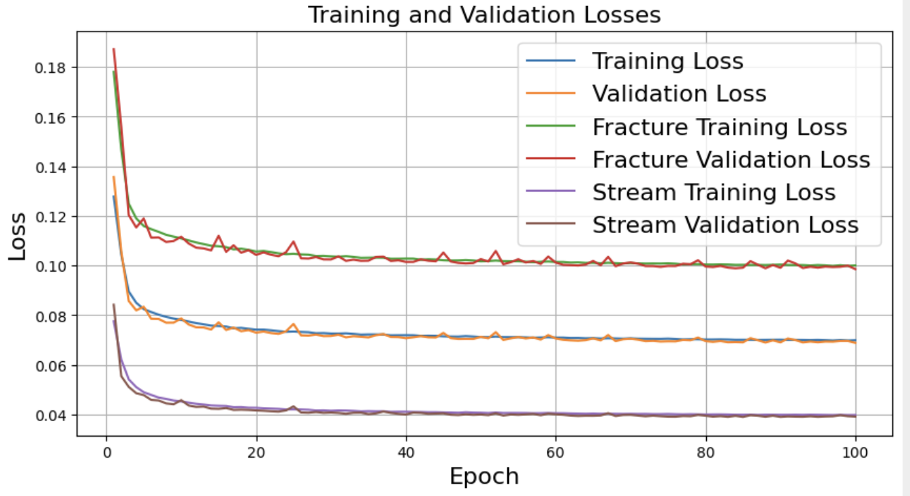

# streams-vs-fractures
repository for work related to identification of streams and fractures on the Greenland Ice Sheet surface

## Model Results

## How to Contribute

This package is being actively developed
[here](https://github.com/YaoGroup/streams-vs-fractures).

If you would like to add new functionality, we welcome new contributions from
anyone as pull requests on [our Github repo](https://github.com/YaoGroup/streams-vs-fractures).

No contribution is too small, and we also welcome requests for new features
or bug reports. To contribute to `streams-vs-fractures` this way, please 
[open an issue on GitHub](https://github.com/YaoGroup/streams-vs-fractures/issues).
